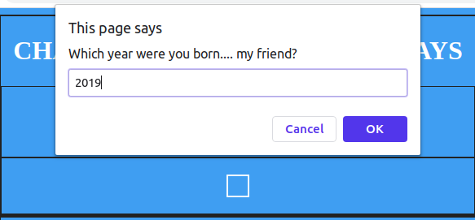

# Age-in-Days

This App needs just your year of birth: for instance you're born 2020, you just enter 2020 and the App will count the days you live. Remember the count is just keeping track of your birth year not the month or the actual day that you're born. For example someone pass in his/her born year as 2019 the answer will be 360 days old even you're born in December 2019.

#### See Example Below

Seeing the screen-shots above you have an inside of how the program is intended....

## How To Use The App

* Open the URL in your browser
* Tap on the CLICK ME button a dialog will pop up
* Enter in your birth year(in figures) hit enter(OK)
* You should see your result 
* Click the RESET button to clear the result
* You can keep processing without clearing the result if you may want to see difference outputs 

#### See Example Below

## Built With:

* HTML
* CSS
* JavaScript

## Author

@touraye

### See Project
Open the URL...
 https://touraye.github.io/Age-in-Days/. 
